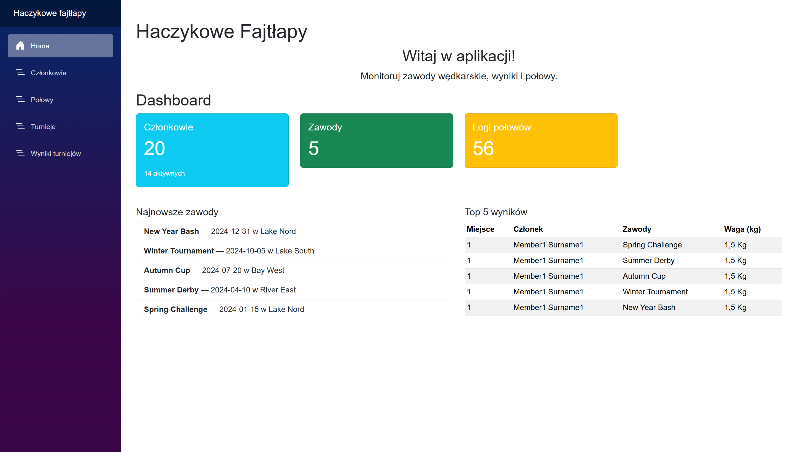
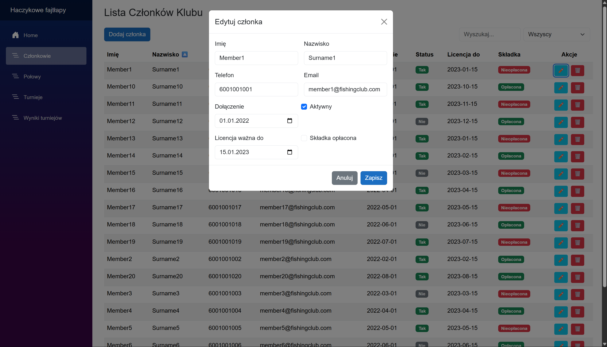
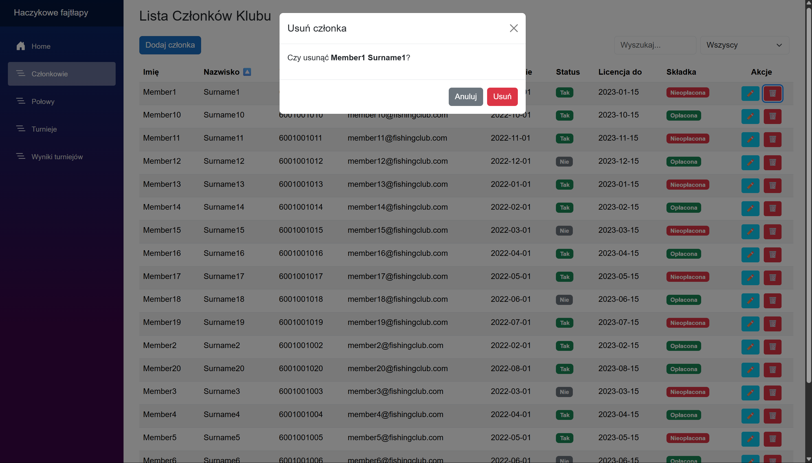
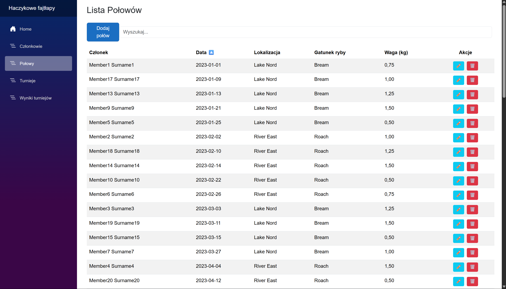
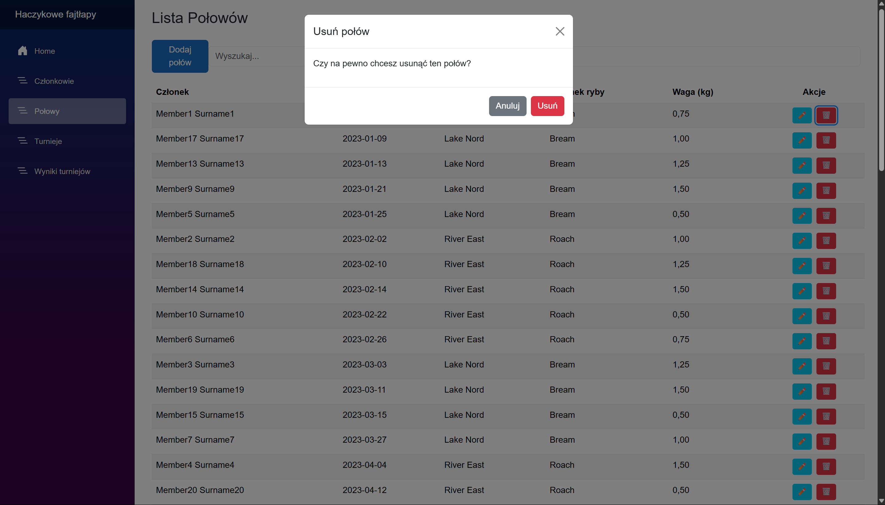
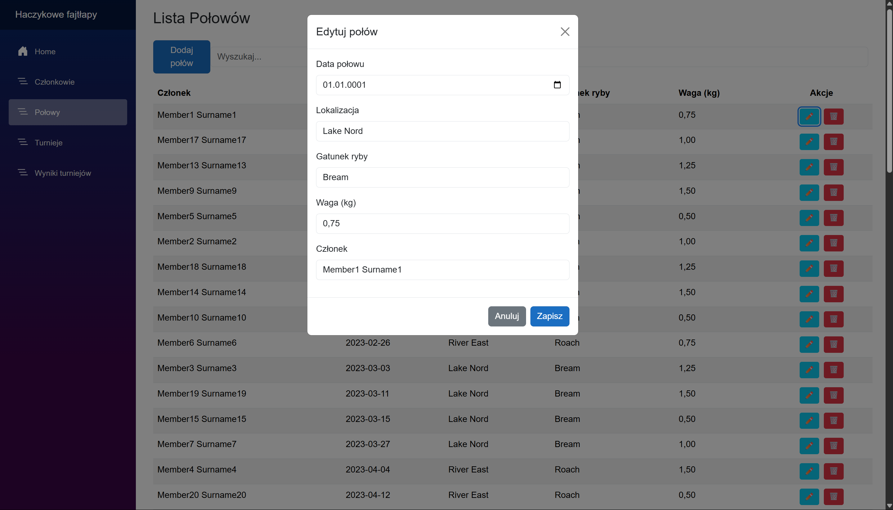
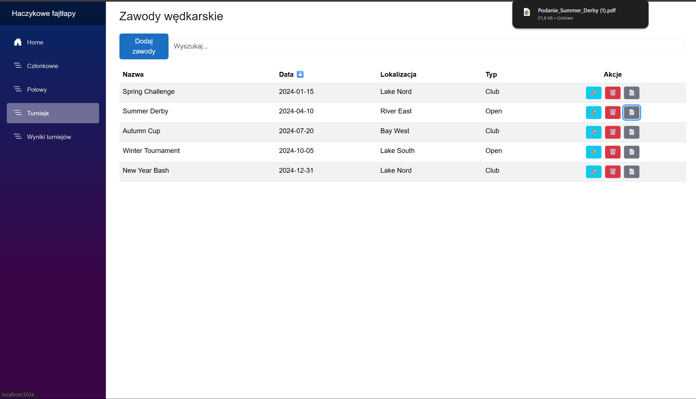
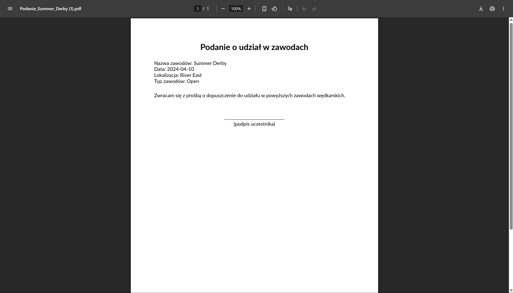

# Dokumentacja Systemu "Haczykowe Fajtlapy"

---

## Spis Treści

1. Wprowadzenie
2. Opis funkcjonalności
3. Architektura systemu
4. Modele danych

    * Członek (Member)
    * Zawody (FishingCompetition)
    * Wynik zawodów (CompetitionResult)
    * Log połowu (FishingLog)
5. Konfiguracja bazy danych

    * FishingClubContext
    * Seed danych
6. Backend API

    * Kontroler PDF
    * Dynamiczne sortowanie
7. Generowanie dokumentów PDF

    * Biblioteka QuestPDF
    * Klasa ApplicationDocument
8. Interfejs użytkownika (Blazor)

    * Strona główna
    * Zarządzanie członkami
    * Logi połowów
    * Wyniki zawodów
    * Zawody
9. Instrukcja obsługi
10. Wymagania systemowe
11. Uwagi dotyczące bezpieczeństwa
12. Rozszerzenia i propozycje rozwoju
13. Zrzuty ekranu

---

## 1. Wprowadzenie

**Haczykowe Fajtlapy** to system zarządzania klubem wędkarskim, przeznaczony do obsługi:

* członkostwa,
* rejestracji zawodów,
* logowania wyników i połowów,
* generowania dokumentów PDF.

Aplikacja została zbudowana w technologii **ASP.NET Core + Blazor Server** z wykorzystaniem **Entity Framework Core** oraz biblioteki **QuestPDF** do generowania dokumentów.

---

## 2. Opis funkcjonalności

* ✅ Rejestracja i edycja danych członków
* ✅ Planowanie i zarządzanie zawodami
* ✅ Przechowywanie wyników zawodów
* ✅ Dodawanie logów połowów
* ✅ Sortowanie, filtrowanie, wyszukiwanie
* ✅ Eksport podania na zawody w formie PDF
* ✅ Walidacja formularzy
* ✅ Interfejs oparty na modalach i Bootstrapie

---

## 3. Architektura systemu

* **Frontend**: Blazor Server
* **Backend**: ASP.NET Core
* **ORM**: Entity Framework Core
* **Baza danych**: SQLite lub SQL Server
* **PDF**: QuestPDF

### Warstwy:

* `Model/` – klasy danych
* `Data/` – EF Core DbContext
* `Controllers/` – REST API
* `Pages/` – komponenty Blazor

---

## 4. Modele danych

#

### Member (Członek)

Zawiera dane osobowe i status członkostwa.

```csharp
public class Member
{
    public int Id { get; set; }
    public string FirstName { get; set; }
    public string LastName { get; set; }
    public DateTime BirthDate { get; set; }
    public string Phone { get; set; }
    public string Email { get; set; }
    public DateTime JoinDate { get; set; }
    public bool IsActive { get; set; }
    public DateTime? LicenseValidUntil { get; set; }
    public bool MembershipFeePaid { get; set; }
    public ICollection<CompetitionResult> CompetitionResults { get; set; }
    public ICollection<FishingLog> FishingLogs { get; set; }
}
```

### FishingCompetition (Zawody)

Opisuje wydarzenia wędkarskie z lokalizacją i datą.

```csharp
public class FishingCompetition
{
    public int Id { get; set; }
    public string Name { get; set; }
    public DateTime Date { get; set; }
    public string Location { get; set; }
    public string CompetitionType { get; set; }
    public ICollection<CompetitionResult> Results { get; set; }
}
```

### CompetitionResult (Wynik zawodów)

Rejestruje wynik konkretnego członka w danych zawodach.

```csharp
public class CompetitionResult
{
    public int Id { get; set; }
    public int MemberId { get; set; }
    public Member Member { get; set; }
    public int CompetitionId { get; set; }
    public FishingCompetition Competition { get; set; }
    public string FishType { get; set; }
    public decimal Weight { get; set; }
    public int Place { get; set; }
}
```

### FishingLog (Log połowu)

Rejestruje aktywność połowu przez członka, niezależnie od zawodów.

```csharp
public class FishingLog
{
    public int Id { get; set; }
    public int MemberId { get; set; }
    public Member Member { get; set; }
    public DateTime Date { get; set; }
    public string Location { get; set; }
    public string FishType { get; set; }
    public decimal Weight { get; set; }
}
```

Każdy model jest mapowany przez Entity Framework Core, wspierany przez atrybuty walidacyjne i związany relacjami w `DbContext`.

---

## 5. Konfiguracja bazy danych

### FishingClubContext

DbContext zawierający konfigurację modeli, relacje oraz dane startowe (seed).

```csharp
public class FishingClubContext : DbContext
{
    public DbSet<Member> Members { get; set; }
    public DbSet<FishingCompetition> FishingCompetitions { get; set; }
    public DbSet<CompetitionResult> CompetitionResults { get; set; }
    public DbSet<FishingLog> FishingLogs { get; set; }
}
```

Zdefiniowano pełne relacje i domyślne wartości (np. `MembershipFeePaid = false`).

### Seedy danych

System zawiera przykładowe dane dla 20 członków, 5 zawodów, 50 logów i 50 wyników.

---

## 6. Backend API

### Kontroler PDF

Obsługuje generowanie pliku PDF folumarza zawierającego dane zawodów:

```csharp
[Route("api/pdf")]
public class PdfController : ControllerBase
{
    [HttpGet("{id}")]
    public async Task<IActionResult> GetPdf(int id) {...}
}
```

### Dynamiczne sortowanie

Klasa rozszerzająca możliwość sortowania wyników wg pola:

```csharp
public static class DynamicSorter
{
    public static IEnumerable<CompetitionResult> OrderByDynamic(...) {...}
}
```

---

## 7. Generowanie dokumentów PDF

### QuestPDF

Użyta do tworzenia dokumentów aplikacyjnych i raportów.

### ApplicationDocument.cs

```csharp
public void Compose(IDocumentContainer container) {...}
```

Dokument zawiera:

* nagłówek,
* dane zawodów,
* prośbę o udział,
* miejsce na podpis,
* stopkę.

---

## 8. Interfejs użytkownika (Blazor)

Każda sekcja aplikacji to oddzielna strona:

* `/members` – lista członków
* `/fishing-competitions` – zawody
* `/competition-results` – wyniki
* `/fishing-logs` – połowy
* `/` – dashboard

Wspólne cechy:

* Modale Bootstrap do dodawania/edycji
* Filtrowanie i sortowanie
* Walidacja formularzy (`EditForm`, `DataAnnotationsValidator`)

---

## 9. Instrukcja obsługi

### Jak dodać członka?

1. Wejdź na `/members`
2. Kliknij "Dodaj członka"
3. Uzupełnij dane
4. Kliknij "Zapisz"

### Jak dodać zawody?

1. Wejdź na `/fishing-competitions`
2. Kliknij "Dodaj zawody"
3. Podaj nazwę, datę, lokalizację i typ
4. Zapisz

### Jak dodać wynik zawodów?

1. `/competition-results`
2. "Dodaj wynik"
3. Wypełnij dane i kliknij "Zapisz"

### Jak pobrać PDF?

1. Przejdź do zawodów
2. Kliknij ikonę 📄 przy zawodach
3. PDF zostanie pobrany

---

## 10. Wymagania systemowe

* .NET 8 lub nowszy
* Przeglądarka obsługująca Blazor Server (Chrome, Edge, Firefox)
* System operacyjny: Windows/Linux/Mac
* Biblioteka QuestPDF zainstalowana

---

## 11. Rozszerzenia i propozycje rozwoju

* ✅ System logowania (role: admin, użytkownik)
* ✅ Wykresy wyników zawodów
* ✅ Notyfikacje mailowe dla członków
* ✅ Kalendarz zawodów
* ✅ Historia zmian (audit trail)

---

## 12. Przykładowe zrzuty ekranu

### 📷 Strona główna (Dashboard)



### 📷 Lista członków





### 📷 Lista Połowów





### 📷 Generowanie PDF





---

**Autor:** Krystian Zygmunt

